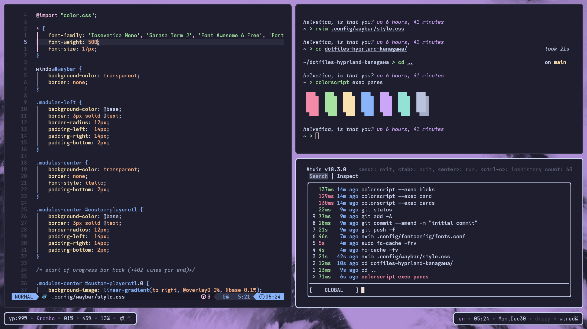
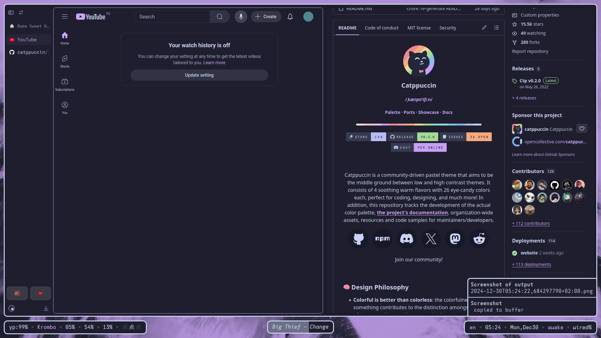
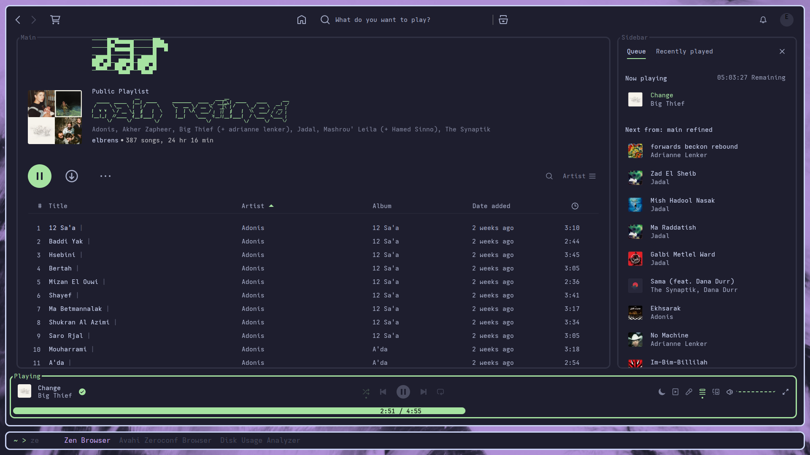
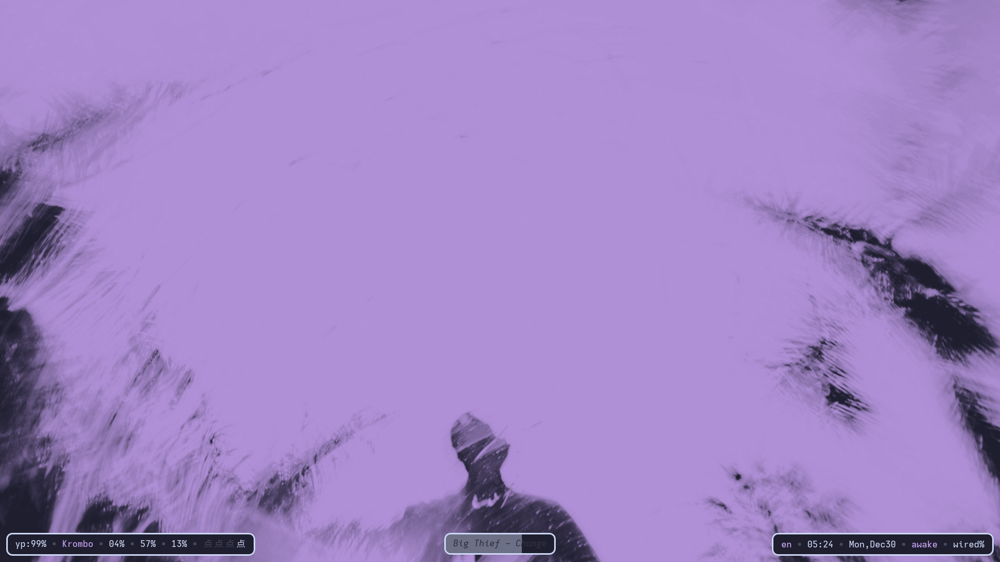

# dotfiles-hyprland-kanagawa
personal daily-driver dotfiles (yet another [Catppuccin](https://github.com/catppuccin/catppuccin) themed rice) for hyprland and my Arch Linux setup. I'll probably continue to support this repo as I add more and more personal mods into it.
## Previews

---

## Packages/Dependencies Used
### swaywm and co. (major UI elements)
- wm: [`hyprland`](https://hyprland.org/), complete with ~almost~ all hypr ecosystem tools: `hyprpaper`, `hyprpicker`, `hypridle`, `hyprlock`, and `hyprcursor`
- main bottom bar: [`waybar`](https://github.com/Alexays/Waybar)
- notification daemon: [`dunst`](https://github.com/dunst-project/dunst)
- app launcher: [`tofi`](https://github.com/philj56/tofi) with theme designed to mimic personal bar config inplace (see [third screenshot](screenshots/3.png))

### extra dependencies required (check after your sway config copy)
`clipman` and `wl-clipboard` (for copying and pasting), `brightnessctl` `playerctl` `pamixer` `wob` (audio/brightness keybindings and progress bar), [`sway-audio-idle-inhibit`](https://github.com/ErikReider/SwayAudioIdleInhibit) for idle inhibiting on audio, `grim` and `grimshot` (for screenshots), `cronie`/`cron` and `udev` for [low battery and charging alert](usr/local/bin/) scripts (from [Eric Murphy's dotfiles' scripts](https://github.com/ericmurphyxyz/dotfiles/tree/master/.local/bin))
- waybar: `playerctl` for custom media module (see [second screenshot](screenshots/2.png))

### terminal stuff
- terminal: [`kitty`](https://github.com/kovidgoyal/kitty)
- shell: `zsh`, modified with [`starship`](https://github.com/starship/starship) and a few plugins and modifications ([`zsh-autosuggestions`](https://github.com/zsh-users/zsh-autosuggestions), [`zsh-syntax-highlighting`](https://github.com/zsh-users/zsh-syntax-highlighting), [`zsh-shift-select`](https://github.com/jirutka/zsh-shift-select))
- shell history: [`atuin`](atuin.sh)
- text editor: [`nvim`](https://github.com/neovim/neovim) with [LazyVim](https://github.com/LazyVim/LazyVim) based config

### theming stuff and miscellaneous
- theme: [Catppuccin](https://github.com/catppuccin/catppuccin) Mocha Mauve.
- wallpaper: modified from this [this wall](https://unsplash.com/photos/a-blurry-image-of-a-man-riding-a-snowboard-Wd99FsCRsRs)
- spotify: [`spicetify-cli`](https://spicetify.app/) with [text theme](https://github.com/spicetify/spicetify-themes/tree/master/text)
- browser: [`zen-browser`](https://github.com/zen-browser/desktop) with custom chrome folder, website themes is done through Catppuccin's [Stylus](https://addons.mozilla.org/en-US/firefox/addon/styl-us/) ports
- monospace font: [custom build named "Iosevetica Mono"](Iosevka/private-build-plans.toml) of [Iosevka](https://github.com/be5invis/Iosevka)
